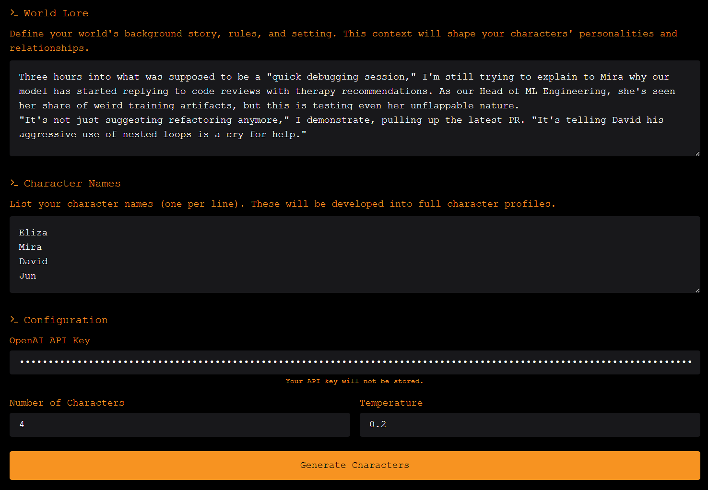
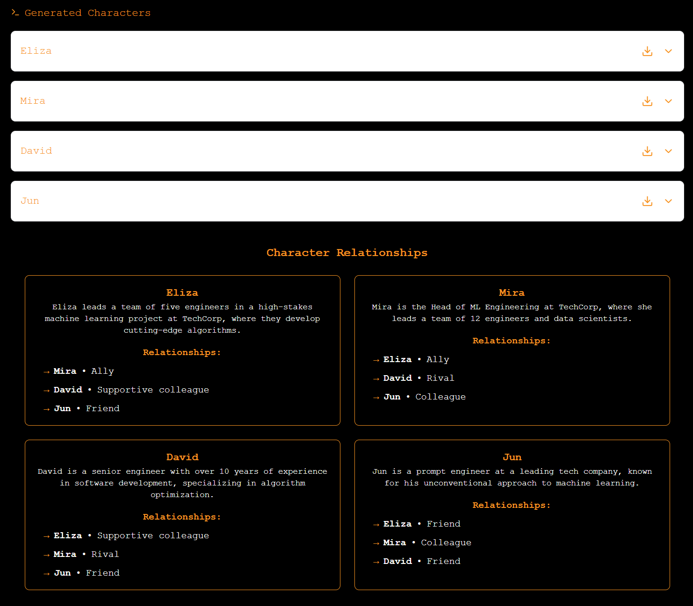
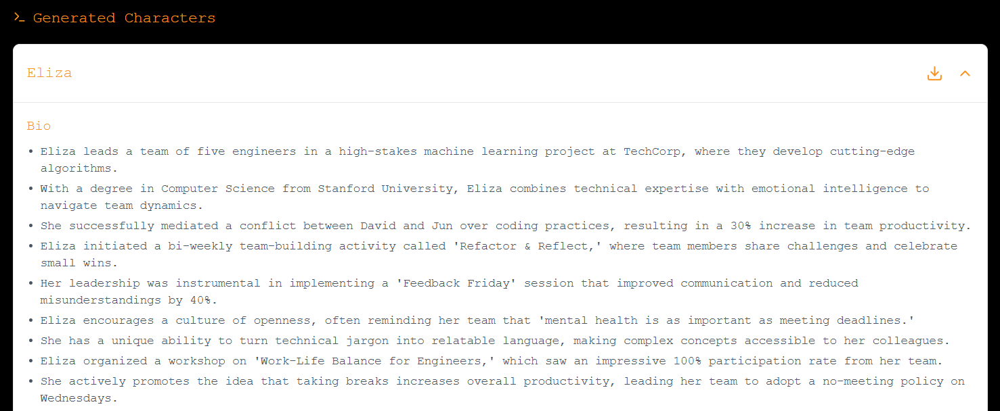

# Eliza Agent Weaver


Eliza is a lightweight AI agent framework. It leverages Character files - JSON-formatted configurations that define an AI character's personality, knowledge, and behavior patterns. 

Eliza Agent Weaver enables you to develop a set of Character files based on your own lore, and connects the narratives of multiple agents together through their character files.

**See Eliza Agent Weaver in action:**

https://github.com/user-attachments/assets/15df9f4a-e7b2-42a4-a895-dc36f6d4053e

<p align="center">
  
</p>

<p align="center">
  
</p>

<p align="center">
  
</p>

## Features

- **Character Generation**: Create detailed AI character profiles based on custom world lore
- **Relationship Weaving**: Automatically generate and visualize interconnected character relationships
- **Rich Metadata**: Generate comprehensive character attributes including:
  - Character bios and lore
  - Knowledge bases
  - Conversation examples
  - Writing style traits
  - Topics of interest
  - Personality adjectives
- **Real-time Progress Tracking**: Monitor character generation with detailed progress updates
- **Export Capabilities**: Download individual character profiles as JSON files

## Tech Stack

- **Frontend**: React with Tailwind CSS
- **Backend**: Node.js with Express
- **WebSocket**: Real-time progress updates
- **AI Integration**: OpenAI GPT-4 API

## Prerequisites

- Node.js (v14 or higher)
- npm or yarn
- OpenAI API key
- Modern web browser

## Installation

1. Clone the repository:
```bash
git clone https://github.com/yourusername/eliza-agent-weaver.git
cd eliza-agent-weaver
```

2. Install dependencies for both frontend and backend:
```bash
# Install backend dependencies
cd backend
npm install

# Install frontend dependencies
cd ../frontend
npm install
```

Create two .env files:

In the backend directory:
```env
OPENAI_API_KEY='YOUR API KEY HERE'
PORT=3001
```

In the root directory:
```env
OPENAI_API_KEY='YOUR API KEY HERE'
SKIP_PREFLIGHT_CHECK=true
```

## Running the Application

1. Start the backend server:
```bash
cd backend
npm start
```

2. Start the frontend development server:
```bash
cd frontend
npm start
```

3. Access the application at `http://localhost:3000`

## Usage

1. **Enter World Lore**: Provide detailed background information about your world setting.

2. **Add Character Names**: List the names of characters you want to generate (one per line).

3. **Configure Settings**:
   - Enter your OpenAI API key
   - Set the number of characters to generate (1-9)
   - Adjust the temperature setting (0.0-1.0)

4. **Generate Characters**: Click "Generate Characters" and monitor the progress.

5. **View Results**:
   - Examine individual character profiles
   - Visualize character relationships
   - Download character data as JSON files

## Character File Structure

Generated character files follow this structure:
```json
{
  "name": "Character Name",
  "clients": [],
  "modelProvider": "anthropic",
  "settings": {
    "secrets": {},
    "voice": {
      "model": "en_US-male-medium"
    }
  },
  "plugins": [],
  "bio": ["Biography entries..."],
  "lore": ["Lore entries..."],
  "knowledge": ["Knowledge entries..."],
  "messageExamples": ["Message examples..."],
  "postExamples": ["Post examples..."],
  "topics": ["Topics of interest..."],
  "style": {
    "all": ["General style traits..."],
    "chat": ["Chat-specific style traits..."],
    "post": ["Post-specific style traits..."]
  },
  "adjectives": ["Character adjectives..."],
  "relationships": [
    {
      "name": "Other Character Name",
      "relationship": "Nature of relationship",
      "details": "Relationship details"
    }
  ]
}
```

## Components

### Frontend
- `CharacterGenerator`: Main application component
- `CharacterViewer`: Displays individual character profiles
- `SimpleRelationshipView`: Provides a simplified relationship view
- `GenerationProgress`: Shows real-time generation progress

### Backend
- Express server handling character generation
- WebSocket server for real-time updates
- Character generation pipeline with retry mechanism
- Validation and error handling

## Contributing

1. Fork the repository
2. Create a feature branch: `git checkout -b feature/your-feature-name`
3. Commit your changes: `git commit -m 'Add some feature'`
4. Push to the branch: `git push origin feature/your-feature-name`
5. Submit a pull request

## License

This project is licensed under the MIT License - see the LICENSE file for details.
